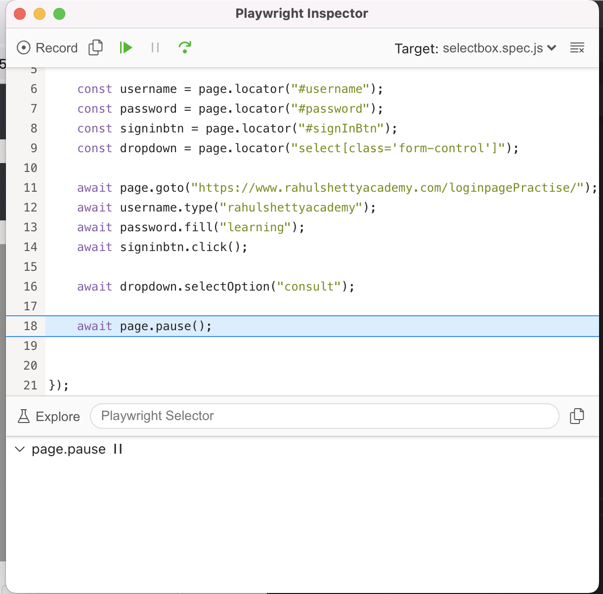
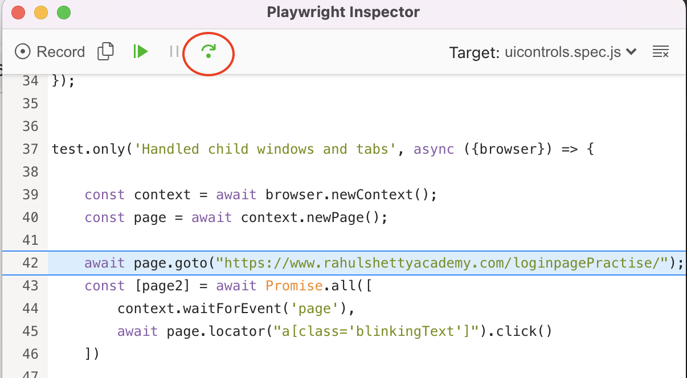
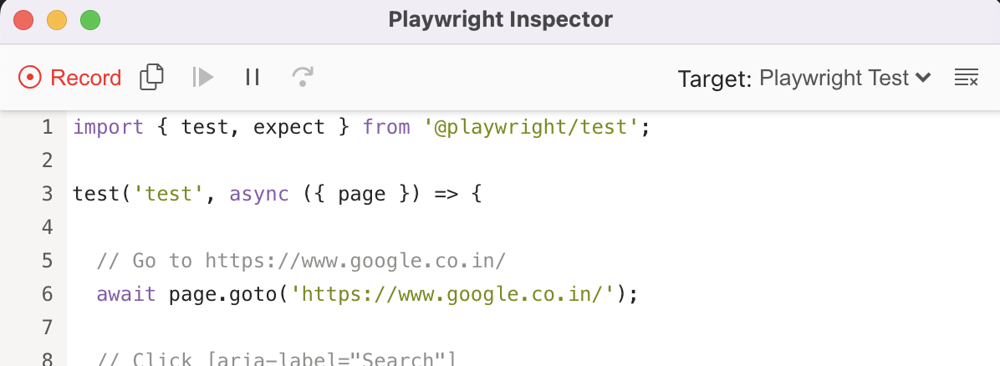

# Install playwright dependencies in Empty folder (Fresh project)

```shell
npm init playwright
```

Default options below:

```shell
✔ Do you want to use TypeScript or JavaScript? · JavaScript
✔ Where to put your end-to-end tests? · tests
✔ Add a GitHub Actions workflow? (Y/n) · true
```

# How to run tests

By default tests run in Headless mode

Inside project root directory, you can run several commands:
```shell
  npx playwright test
    Runs the end-to-end tests.

  npx playwright test --project=chromium
    Runs the tests only on Desktop Chrome.

  npx playwright test tests/example.spec.js
    Runs the tests of a specific file.

  npx playwright test --debug
    Runs the tests in debug mode.
```
We suggest that you begin by typing:
```shell
  npx playwright test
```  

# How to run tests in Headed mode

By default tests run in Headless mode, To run them in headed mode use below command

```shell
npx playwright test --headed
```

In config you can find propery headless under use

```shell
headless: true
```

# First Test - How to go to particular url, get page title and do assertion
```javascript
const {test, expect} = require('@playwright/test'); //import test variable, expect for doing assertions from playwright config

test('Page playwright test', async ({page}) => {
    await page.goto("https://www.linkedin.com");
    console.log(await page.title());
    await expect(page).toHaveTitle("LinkedIn: Log In or Sign Up");
});
```
# How to wait for page load - till all network calls are done - means network came to idle state
```javascript
await page.waitForLoadState('networkidle');
```

# How to wait after clicking a button then page load - wait for navigation complete
```javascript
await Promise.all(
    [
        page.waitForNavigation(),
        signIn.click();
    ]
)
```

# How to type text to textbox

Two ways to acheive this 
1) using type method (or) 
2) using fill method
```javascript
await page.locator("#username").type("rahulshettyacademy");
await page.locator("#password").fill("learning");
```
# How to perform click on a button

```javascript
await page.locator("#signInBtn").click();
```

# How to access when more than 1 element is matching the locator


Here Locator ".card-body a" matches to give 4 elements.<br><br>

To fetch 1st element from the matching elements
```javascript
console.log(await page.locator(".card-body a").first().textContent());
```
To fetch last element from the matching elements
```javascript
console.log(await page.locator(".card-body a").last().textContent());
```
To fetch 1st element using nth method
```javascript
console.log(await page.locator(".card-body a").nth(0).textContent());
```
To fetch all text contents of matching elements
```javascript
console.log(await page.locator(".card-body a").allTextContents());
```

# How to pause execution -> like sleep/pause for debugging - this opens playwright inspector
For example i want to select a option in dropdown and then pause
```javascript
await dropdown.selectOption("consult");
await page.pause();
```
Inspector looks like this


<br>
<br>

# How to select from drodpwn - select box

```javascript
await dropdown.selectOption("consult");
```

# How to know if Radio button is checked or not, 

```javascript
await expect(page.locator(".radiotextsty").last()).toBeChecked(); //assertion to check if a radio btn is checked
console.log(await page.locator(".radiotextsty").last().isChecked()); //just true/false if checked/unchecked
```
# How Uncheck a checkbox and assert if it is Unchecked
```javascript
await page.locator("input[name='terms']").uncheck(); //uncheck checkbox
expect(await page.locator("input[name='terms']").isChecked()).toBeFalsy(); //assert isChecked is giving false
```
# How to do assertion to expect an attribute should have some value
```javascript
await expect(page.locator("a[class='blinkingText']")).toHaveAttribute("class", "blinkingText");
```

# How to switch tabs 
we need to do a prmoise on waitforEvent of page and then click
here pages are returned in array
```javascript
    const context = await browser.newContext();
    const page = await context.newPage();

    await page.goto("https://www.rahulshettyacademy.com/loginpagePractise/");
    const [page2] = await Promise.all([
        context.waitForEvent('page'),
        await page.locator("a[class='blinkingText']").click()
    ])
    
    console.log( "========> "+ await  page2.locator("p[class='im-para red']").textContent());

    // Now we can perform actions in tab1 too using page.locator()..
```

# How to run tests in debug mode - This opens debugger playwright

Using this debugger we can execute test, step by step using Step over icon
<br/><br/>


# How to use Playwright Record and Playback script

```shell
npx playwright codegen https://www.google.co.in
```

<br/><br/>



